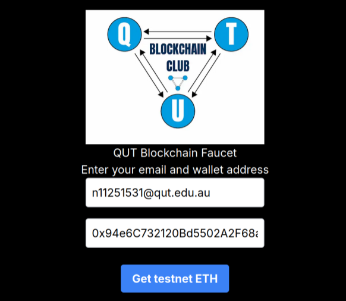
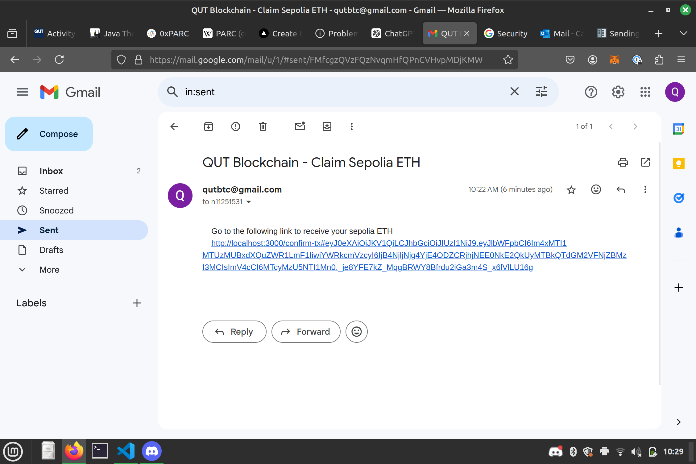
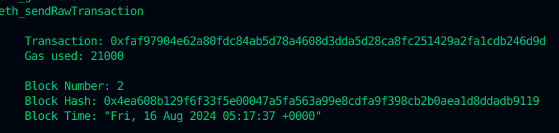
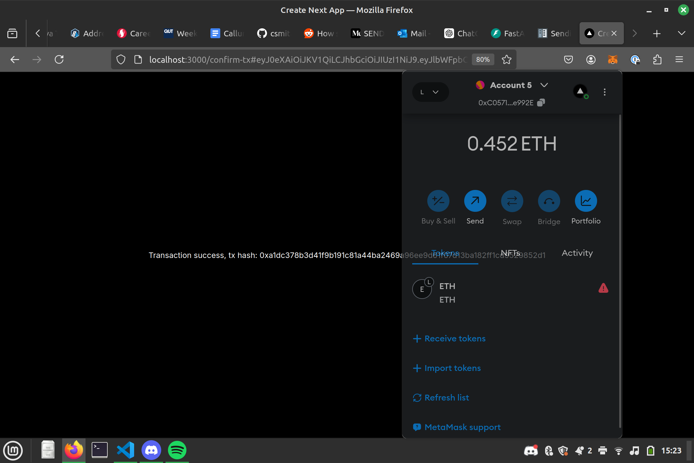

This is a sepolia ETH Faucet designed to be used by QUT students, IFB452 students and members of the QUT Blockchain Club.

Claiming sepolia ETH works by entering your student email (ending in qut.edu.au) and your desired wallet address, and then confirming your request via an email link containing a one-time password.

